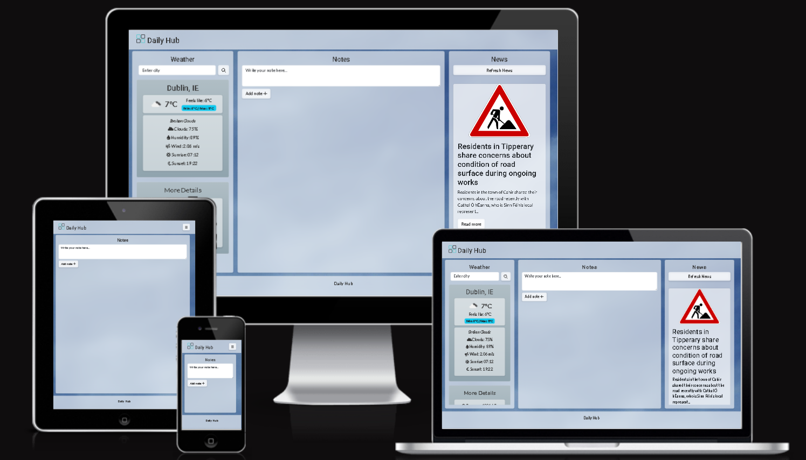
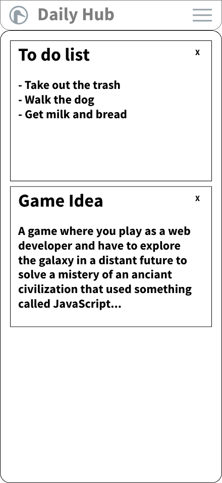
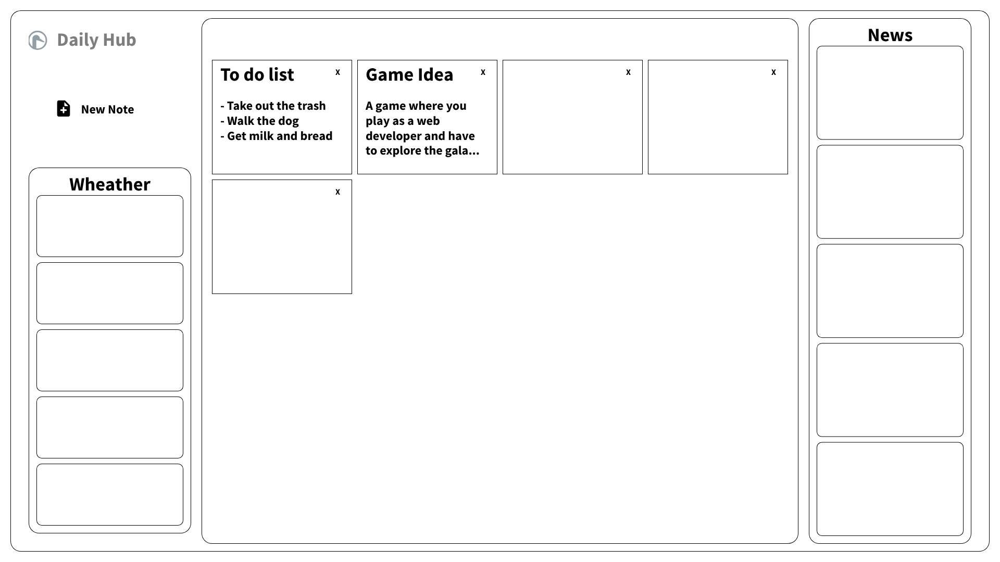

# Daily Hub Dashboard

A single-page, responsive dashboard that provides access to a personal note taking space, local weather, and latest news.


---

## **Project Goal**

The goal of this project was to create a clean and intuitive website that serves as a hub for essential daily information. This project was developed to show proficiency in front-end web development, API integration, and creating a responsive user experience.

---

## **UX (User Experience)**

### **Strategy**

- **Target Audience:**  
  The primary target audience is a user who wants a quick and easy way to manage daily information without navigating multiple websites or apps. This includes anyone looking for a quick and simple digital hub.

- **User Goals:**
  - Get a quick overview of the current weather.  
  - Write down and manage personal notes.  
  - Browse the latest headlines and news articles.  
  - Access all these features from any device, including desktop, tablet, and mobile through a single website.  

- **Developer Goals:**
  - Demonstrate an understanding of HTML, CSS, and JavaScript.  
  - Integrate data from APIs.  
  - Build a responsive user interface. 

### **Design**

The design idea for the Daily Hub was to create a clean and modern look that is visually pleasing and functional.

- **Colour Scheme:**  
  The colour palette is intentionally minimal, focusing on a more neutral background and semi-transparent panels. This ensures the content (notes, weather info, and news headlines) remains the main focus. The blurred glass effect adds a modern touch without being distracting.

- **Typography:**  
  The dashboard uses **Roboto** for headings and **Lato** for body text, these are sans-serif fonts chosen for good readability and clarity through different screen sizes.

### Wireframes
Wireframes were created to plan the structure and layout of the dashboard:

| Mobile | Desktop |
|--------|---------|
|  |  |

---

## **Features**

- **Weather Section:**
  - Search for weather information by city.  
  - Displays temperature, humidity, and wind speed.  
  - Weather icon represents the current condition. 
  - Dinamic card background that adapts to current weather condition. 

- **Notes Section:**
  - In-browser note-taking tool.  
  - Add and delete notes.  
  - Notes saved in `localStorage` do not get wiped on page refresh.  

- **News Section:**
  - Displays the latest news headlines with image, title and descriptions.  
  - Includes a "Refresh News" button to fetch new articles.  

- **Responsive Layout:**
  - Fully adapts to desktop, tablet, and mobile.  
  - On small screens, navigation switches to an offcanvas mobile menu.  
  - On larger screens, all three sections display in a grid layout.  

---

## **Technologies Used**

### **Languages**
- HTML  
- CSS  
- JavaScript  

### **Frameworks & Libraries**
- Bootstrap — for responsive grid, offcanvas menu, and components.  
- Font Awesome — for icons in navigation, weather, and news.  

### **APIs**
- OpenWeatherMap API — weather data.  
- Gnews API — news headlines.  

### **Tools**
- Git & GitHub — version control and hosting.  
- GitHub Pages — deployment.  
- Visual Studio Code — development environment.  
- W3C Validators — HTML and CSS validation.  

---

## **Deployment**

This project was developed using VS Code and version-controlled with Git. All changes were regularly committed and pushed to GitHub. The site is deployed using **GitHub Pages**.

### Deployment Steps
1. Log in to [GitHub](https://github.com).  
2. Navigate to your project repository.  
3. Go to **Settings** → **Pages**.  
4. Under **"Source"**, select the `main` branch and `/ (root)`.  
5. Click **Save**. GitHub generates a live link for your site.  
6. Future pushes to `main` update the live site automatically.  

### Running the Project Locally
1. Go to the repository on GitHub.  
2. Click the green **Code** button and copy the HTTPS link.  
3. Open a terminal in your preferred editor or IDE.  
4. Run:  
   ```bash
   git clone <your-repo-link>
   cd <your-repo-name>
   ```  
5. Open `index.html` in a browser.  

---

## **Testing**

Testing was conducted both manually and with validators to ensure functionality, responsiveness, and accessibility.

### **Manual Testing**

| Test Objective | Test Steps | Expected Result | Actual Result |
|----------------|------------|----------------|---------------|
| **Weather Search (valid city)** | Enter valid city → Search | Weather updates with correct data + icon | Pass | — |
| **Weather Search (invalid city)** | Enter invalid city → Search | Error message shown | Pass |
| **Notes (add)** | Type note → Add Note | Note appears in list | Pass |
| **Notes (delete)** | Delete existing note | Note removed & storage updated | Pass |
| **Notes (persistence)** | Add note → Refresh page | Note remains | Pass |
| **News (load)** | Load page | News headlines appear | Pass | — |
| **News (refresh)** | Click Refresh button | Headlines update | Pass |
| **Responsiveness** | Resize window / mobile | Layout adapts correctly | Pass |

### **User Stories Testing**

- As a user, I want to quickly see the weather → Works with search.  
- As a user, I want to save quick thoughts → Notes persist in localStorage.  
- As a user, I want to see the latest headlines → News auto-loads and refresh works.  

---

## **Validator Testing**

- **HTML:** Validated with [W3C Markup Validator](https://validator.w3.org/) — no critical issues.  
- **CSS:** Validated with [W3C CSS Validator](https://jigsaw.w3.org/css-validator/) — no critical issues.  

---

## **Accessibility & Lighthouse Testing**

The project was tested with **Google Lighthouse** to evaluate performance, accessibility, and SEO.  

| Category        | Score |
|-----------------|-------|
| Performance     | 83    |
| Accessibility   | 91    |
| Best Practices  | 78    |
| SEO             | 100   |
 
---

## **Future Enhancements**

- Improve Lighthouse **Performance** .  
- Add ARIA roles and labels to improve **Accessibility**.  
- Extend Notes functionality (e.g., edit notes).  
- Add location-based weather search.  
- Implement dark theme.  

---

## **Credits**

### **Code & Assets**
- **Bootstrap** for layout and components.  
- **Font Awesome** for icons.  
- **OpenWeatherMap API** for weather data.  
- **Gnews API** for news.  
- **Background Image:** from [Pexels](https://www.pexels.com/).  

### **Acknowledgments**
- Thanks to Code Institute for all the support.  

---
